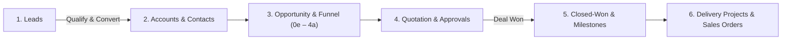
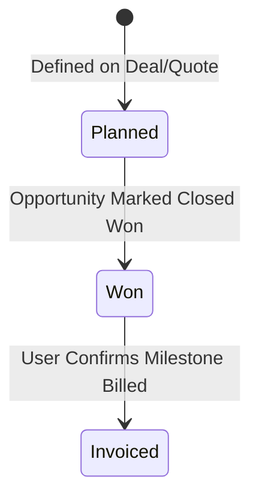

# Super-ERP (Quandatics CRM) End-to-End User Guide

A complete, practical guide to operating Super-ERP (Quandatics CRM v2) through the web interface across the full customer lifecycle.

---

## Table of Contents

1. [System Overview & Lifecycle](#system-overview--lifecycle)
2. [Workspace Basics & Personal Saved Views](#1-workspace-basics--personal-saved-views)
3. [Lead Management & Conversion](#2-lead-management--conversion)
4. [Accounts & Contacts](#3-accounts--contacts)
5. [Opportunities & Sales Funnel](#4-opportunities--sales-funnel)
6. [Quotations, Pricing & Approvals](#5-quotations-pricing--approvals)
7. [Payment Milestones & Cash Planning](#6-payment-milestones--cash-planning)
8. [Delivery Projects & Sales Orders](#7-delivery-projects--sales-orders)
9. [Approvals Hub](#8-approvals-hub)
10. [System Administration & Settings](#9-system-administration--settings)

---

## System Overview & Lifecycle

Super-ERP connects sales, delivery, and commercial planning through a single business lifecycle:

---

## 1. Workspace Basics & Personal Saved Views

### Navigation & Tenant Switching
* **Sidebar Groups**: CRM, Sales, Insights, and Admin.
* **Organization Switcher** *(Top of Sidebar)*: Switch between organizations. All data, settings, and permissions are strictly isolated per tenant.
* **User Roles**:
  * **Owner (Tier 100)**: Full system configuration, billing, and all data.
  * **Manager (Tier 60)**: Pipeline visibility over team, approvals authority.
  * **Sales Rep (Tier 20)**: Day-to-day lead, deal, and quotation management.
  * **Viewer (Tier 10)**: Read-only access across assigned records.

### Mastering List Views
Every major data list features a unified controls toolbar:
* **Search**: Instant text search across names, codes, and emails.
* **Filters**: Add structured conditions (e.g., `Status equals Qualified`).
* **Columns**: Toggle visible fields to customize your screen layout.
* **Page Size**: Choose between 25, 50, or 100 rows per page.
* **Saved Views**: Save your filter/column setup under **Views → Save view as...**. Saved views are strictly **private to your account** and do not impact teammates.

---

## 2. Lead Management & Conversion

A **Lead** (`/leads`) captures unverified inbound interest (web forms, events, referrals).

### Creating & Qualifying Leads
1. Navigate to **CRM → Leads** and click **+ New Lead**.
2. Complete contact details, company name, lead source, estimated value, and assigned owner.
3. Advance the lead status: `New` ➔ `Contacted` ➔ `Qualified` or `Disqualified`.
4. If **Disqualified**, select a required reason (e.g., *No Budget, Out of Scope*). Disqualified leads can be restored back to `Contacted` at any time.

### The Conversion Transaction (`/leads/[id]/convert`)
When a lead is ready for proposal:
1. Open the lead and click **Convert Lead**.
2. Complete the full-page conversion wizard:
   * **Account**: Link an existing Account or create a new one (*Client* or *Reseller*, Code, Address).
   * **Contact**: Creates or links the primary stakeholder contact.
   * **Opportunity & Funnel**: Creates the Opportunity container and seeds the sales deal into stage **`0e` (Identified)**.
3. Click **Confirm Conversion**. This is an atomic, permanent one-way transaction.

---

## 3. Accounts & Contacts

### Accounts (`/accounts`)
* Represents the client company or partner entity.
* **Required ISO Currency**: Every Account must have an assigned currency (e.g., `MYR`, `USD`, `SGD`). All downstream opportunities and quotes automatically inherit this currency.
* **360° Account View**: Displays company details, linked Contacts, open Opportunities, generated Quotations, and an Activity audit stream.

### Contacts (`/persons`)
* Represents individual stakeholders at client organizations.
* Captures full name, job title, email, direct phone, and primary contact designation.
* The primary contact's details are automatically copied into proposal attention fields.

---

## 4. Opportunities & Sales Funnel

### Opportunity Codes & Two-Tier Model
* **Opportunity Container**: Commercial header holding PPVVC qualification and overall budget.
* **Funnel Deal**: The active pursuit tracking pipeline stages, line items, and closing dates.
* **Code Format**: System-generated immutable identifier:
  $$\text{ORGCODEOPP-YYYY-NNNN} \quad (\text{e.g., } \texttt{QDTOPP-2026-0015})$$

### The PPVVC Qualification Framework
Document qualification rigor directly on the Opportunity:
* **Power Sponsor**: Who is the economic buyer with signature authority?
* **Pain**: What critical business problem are they solving?
* **Vision**: What agreed solution vision did you co-design?
* **Value**: What is the quantifiable ROI / economic return for the client?
* **Control**: What governance or influence do you have over their buying timeline?

### Sales Stages & Automations
* **`0e` Identified**: Initial discovery after lead conversion.
* **`1d` Qualified**: Scoping and stakeholder alignment.
* **`2c` Proposal**: Technical and commercial feasibility.
* **`3b` Negotiation**: Formal quote submitted to customer.
* **`4a` Commit**:
  * **Automation**: Entering stage `4a` for the first time **automatically allocates the official Project Code** for delivery resource planning.
* **Closed Won** *(Terminal)*:
  * Deal is won.
  * Automatically sets all linked payment milestones to **`Won`**.
  * Locks the opportunity from further stage progression.
* **Closed Lost** *(Terminal)*:
  * Deal lost. Requires entering **Lost Reason** and **Winning Competitor**.

> **Stage Movement Rule**: You can roll back to any prior non-terminal stage without restriction. Advancing forward enforces stage-gate checks and required data validations.

---

## 5. Quotations, Pricing & Approvals

A **Quotation** (`/quotations`) defines itemized pricing and terms.

### Creating Quotes & Snapshots
1. Click **+ New Quotation** from the Funnel deal or Quotations list.
2. The quote immediately captures an immutable snapshot of:
   * **Payment Terms** & **Delivery Notes** (from Settings).
   * **Attention Contact** (from Account Primary Contact).
   * **Tax Rates** (e.g., 8% SST / Tax Inclusive vs Exclusive).

### Line Items & Templates
* Add items from the **Product Catalog** or enter custom descriptions.
* Configure Quantity, Unit Price, and Discount %.
* Select between **Standard Proposal** and **Quandatics Academy** templates.

### Approval & Revision Lifecycle
* **`Draft`**: Being drafted by sales rep.
* **Submit for Approval**: Submit every quotation to the first active reporting manager with quotation approval permission. Review happens on the quotation detail page. Status moves to **`Pending Approval`**.
* **`Approved`**: Manager approves the quote.
* **`Sent`**: Rep marks quote as delivered to the customer.
* **Revisions**: If the customer requests changes, click **Revise**. The system keeps the original quote locked in history and creates a new linked Draft revision (e.g., `-Rev1`).
* **PDF Export**: Click **Preview / PDF** to download a clean, client-ready proposal.

---

## 6. Payment Milestones & Cash Planning

Payment milestones (`/payment-milestones`) track commercial billing events (e.g., *Deposit, Milestone 1, Final Sign-off*).

* **Planning Role**: Serves as a cashflow and operational billing tracker (decoupled from automated ERP invoicing).
* **Automated Won Trigger**: When the parent opportunity is marked **Closed Won**, all live milestones automatically transition to **`Won`**.
* **Transition to Invoiced**: Once an invoice is issued to the client for that milestone, the user opens the milestone and marks it as **`Invoiced`**. Once invoiced, it cannot be reverted.

---

## 7. Delivery Projects & Sales Orders

### Projects (`/projects`)
* Project codes are reserved on stage `4a` and formalized upon deal closing.
* Assign Project Managers, delivery scopes, start dates, and target completion dates.

### Sales Orders (`/sales-orders`)
* Captures the customer's confirmed Purchase Order (PO) document.
* Attach the customer PO number, PO date, approved quote reference, and signed PO scan.
* Submitted orders are reviewed and approved by management to authorize procurement.

---

## 8. Approvals Hub

Located at **Sales → Approvals** (`/approvals`), this shows stage requests assigned to eligible reporting managers:
* **Pending Approvals Queue**: Displays stage advancement requests, 25 per page. Quotation approvals are reviewed on quotation detail pages.
* **Reviewing**: Inspect the funnel, requested stage, attachments, and requester notes.
* **Decision**:
  * **Approve**: Advances the funnel if its current transition and required fields remain valid.
  * **Reject**: Closes the stage request; a review note is optional. Quotation rejection requires a reason and sets the quotation to Rejected.

---

## 9. System Administration & Settings

### Team & Roles (`/team`)
* Invite colleagues and assign access tiers (**Owner, Manager, Sales Rep, Viewer**).
* Set direct reporting managers for approval routing.

### Forecast (`/forecast`)
* View weighted sales projections based on deal value, stage probability, and target close dates.

### Audit Log (`/audit`)
* Full compliance trail tracking all record creations, field updates, stage shifts, and administrative actions with old vs. new value diffs.

### Tenant Settings (`/settings`)
* **General**: Entity name, base ISO currency, fiscal calendar.
* **Taxonomy**: Custom lead sources, lost reasons, and product categories.
* **Documents**: Default quote terms, warranty clauses, and tax percentages.
