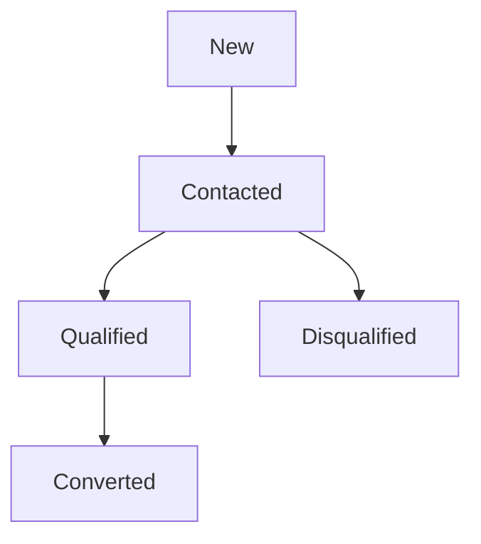
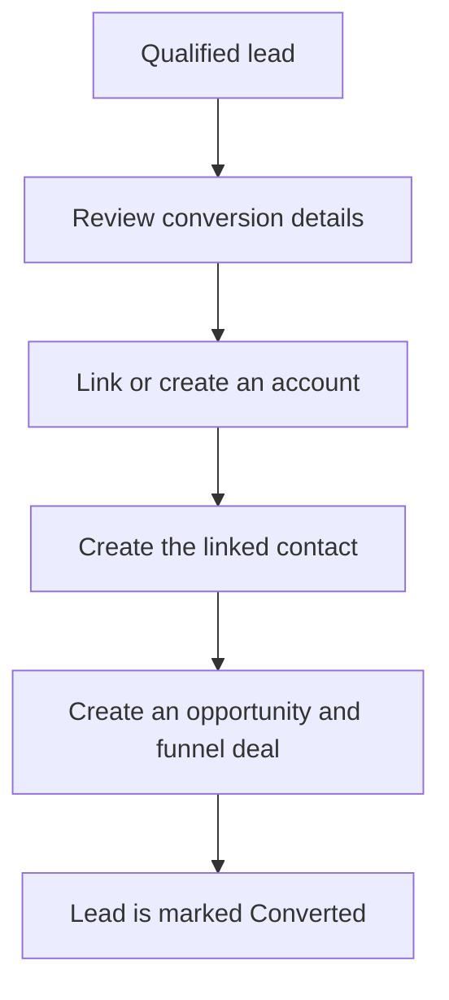

# Leads and conversion

Capture prospects, qualify them, and convert the right leads.

**New to these terms?** Read the [terminology reference](https://jienweng.gitbook.io/q-app/reference/terminology#lead).

## On this page

* [Create a lead](#creating-a-lead)
* [Understand statuses](#lead-statuses)
* [Convert a lead](#converting-a-lead)

---

## What is a Lead?

A **Lead** represents an unverified inbound expression of interest (e.g., from a web form, event booth, partner referral, or cold outreach). It serves as a staging area to qualify prospects without cluttering your core accounts and active sales pipeline.

---

## Creating a Lead




#### Open Leads

Navigate to **CRM → Leads** in the left sidebar.




#### Start a new lead

Click the **+ New Lead** button in the top right corner.




#### Enter prospect details

Fill in the lead information:

* **Name**: The prospect’s contact name.
* **Company Name**: The prospective organization name.
* **Email**: Required valid address; it becomes the contact email during conversion.
* **Phone**: Optional contact number.
* **Lead Source**: Where the lead originated (e.g., *Website, Referral, Event, Cold Outreach*).
* **Status**: Review the initial status. Ownership is assigned to the creating member; it is not an owner selector in this form.

Add follow-up context through the lead’s activity controls after creation. The current create form does not include Estimated Value or Notes fields.




#### Create the lead

Click **Create Lead**.




---

## The Lead Lifecycle

**Read the diagram:** a lead moves through outreach and qualification before conversion. A lead can also be disqualified when it is not worth pursuing. The detail page does not provide a Restore to Contacted action.

### Lead Statuses

* **`New`**: Newly received lead awaiting initial review.
* **`Contacted`**: Outreach has commenced (email sent, call made, meeting scheduled).
* **`Qualified`**: The prospect has verified need, budget, and authority.
* **`Disqualified`**: The prospect is not a fit for your services.

### Handling Disqualification
When marking a lead as **Disqualified**:




#### Enter a disqualification reason

Use **Disqualify** and type a non-empty **Reason**, such as “No budget for this year.” The current dialog uses a text input, not a structured reason dropdown.




#### Record context

Confirm the disqualification. The typed reason is saved with the lead and recorded in its activity history.




#### Understand the available follow-up actions

The lead detail page locks status controls for Disqualified and Converted records. There is no dedicated disqualification restore action. **Undo** in the Leads list’s deletion toast only reverses deletion, requires Delete leads permission and record access, and preserves the prior status. It does not restore a Disqualified lead to Contacted.

**Current inconsistency:** the list’s **Edit** form still offers the full status selector, while detail-page status controls are locked. Do not use that selector to imitate conversion: setting Converted there does not run the linked-record conversion workflow. Ask your administrator or support contact to review a disqualified lead that needs renewed follow-up.




---

## Converting a lead

Qualify the lead before converting as a team practice. The current Convert action is available for non-Converted leads and does not enforce Qualified status. When ready for a commercial proposal, convert it using the **Conversion Wizard**. Add a valid email to the lead before converting; the new contact requires one.

**Result:** the converted lead links to the customer records and sales pursuit. Review account matching and currency before confirming; the same lead cannot be converted twice.

View a static copy of the conversion flow

<figure><figcaption>
Lead conversion creates linked records; it is not a status change alone.
</figcaption></figure>

### Step-by-step conversion




#### Open the lead

Open the Lead detail page.




#### Start conversion

Click the **Convert Lead** button in the top action bar.




#### Review the linked records

You will be redirected to the full-page conversion wizard:

* **Account Section**:
  * **Link Existing Account**: The wizard scans your database for matching company names. If a match is found, you can link to the existing Account.
  * **Create New Account**: If no match exists, select `Create New Account`. Specify the Account Type (*Client* or *Reseller*), Account Code, and Address.
* **Contact Section**:
  * Automatically creates a new Contact record pre-filled with the lead's name, email, and phone number, associated with the Account.
* **Opportunity & Funnel Section**:
  * **Opportunity Name**: Defaults to `[Company Name] opportunity` (customizable).
  * **Expected Close Date**: Set the estimated closing target date.
  * The deal is automatically seeded into the sales funnel at the initial stage **`0e` (Identified)**.




#### Convert the lead

Click **Convert lead**.





**Review before converting.** Conversion creates linked records and marks the lead Converted. You cannot convert the same lead again.


## Continue

* [Accounts & contacts](03-accounts-and-contacts.md)
* [Troubleshooting](help-center/troubleshooting.md)
* [Back to start](https://jienweng.gitbook.io/q-app)
