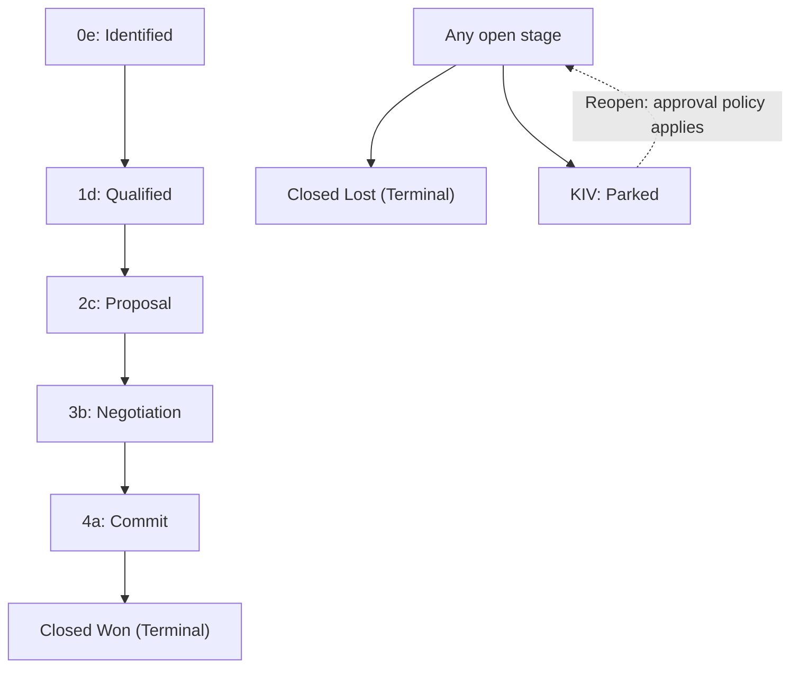

# Opportunities and sales funnel

Qualify a customer need and keep each sales pursuit at the right stage.

**New to these terms?** Read the [terminology reference](https://jienweng.gitbook.io/q-app/reference/terminology#opportunity).

## On this page

* [Record PPVVC](#the-ppvvc-qualification-framework)
* [Fields and gates by stage](#fields-and-gates-by-stage)
* [Park or reopen with KIV](#kiv-keep-in-view)
* [Understand stages](#funnel-stages-and-lifecycle)
* [Change a stage](#stage-advancement-and-rollback-rules)

---

## Filter funnels by expected close year

On **Funnel**, use **Expected close year** to select one or more calendar years. The same filter applies to both **Board** and **List** views, including stage counts and amount totals. It combines with Account, Opportunity, Account owner, Stage, Status and search filters.

Year options come from Expected Close Dates on the records you can access. Selecting 2026 includes dates from 1 January through 31 December 2026. Funnels with no Expected Close Date are excluded while a year is selected; clear the filter to include them again. This filter uses **Expected Close Date**, rather than project year or creation date.

The redundant Funnel selector has been removed from the Funnel page. Use search to find a specific funnel by its name. Funnel search matches only the funnel name; account names, opportunity names, owners and other columns are not searched. Relation filter search inputs narrow their own available options.

## The Opportunity Model

In Q-App, sales pursuits are managed through a structured two-tier structure:

* **Opportunity Container**: The top-level commercial record holding overall customer relationship context, PPVVC qualification, and target budget.
* **Funnel Deal**: The active sales pursuit tracking the exact deal stage, line items, quotations, and closing timeline.

### Opportunity Codes
Every Opportunity is assigned a system-generated, immutable identifier:
`ORGCODEOPP-YYYY-NNNN`
*(Example: `QDTOPP-2026-0015`)*

This code remains constant throughout the deal lifecycle and links the related quotations and commercial records together.

---

## The PPVVC Qualification Framework

To ensure consistent sales rigor, every Opportunity includes a dedicated **PPVVC** qualification panel:

| Pillar | Focus | What to Document |
| :--- | :--- | :--- |
| **Power Sponsor** | Authority & Budget | Who is the economic buyer with signature authority? Is this person actively supporting your proposal? |
| **Pain** | Business Problem | What specific business problem, bottleneck, or financial loss is the customer experiencing? |
| **Vision** | Agreed Solution | What solution design or strategic capability has been agreed upon with the customer? |
| **Value** | Quantifiable ROI | What is the measurable financial return, cost savings, or operational efficiency for the client? |
| **Control** | Process Governance | What influence do you have over their RFP timeline, decision criteria, and procurement approval milestones? |


PPVVC is shared opportunity context. A completion badge is not proof that every stage requirement is satisfied: Power Sponsor contact and budget are separate saved fields, and operational fields belong to the funnel.


---

## Funnel Stages and Lifecycle

Deals progress through standard stages:

**Read the diagram:** the arrows show a typical progression. Available targets and required fields are shown in the stage-change dialog; the workflow does not require every deal to move one stage at a time.

### Stage Definitions

* **`0e` Identified**: Initial scoping after lead conversion or new pursuit creation.
* **`1d` Qualified**: Active stakeholder discussions and requirement gathering.
* **`2c` Proposal**: Technical and commercial feasibility assessment; drafting architecture.
* **`3b` Negotiation**: Formal proposal and quotation submitted to the client.
* **`4a` Commit**: The pursuit is near commitment. Confirm the customer decision and quotation details before recording the outcome.
* **Closed Won** *(Terminal)*:
   * Contract executed and deal won.
   * **Automatic Action**: Sets live Planned payment milestones to `Won`; Invoiced milestones retain their status.
   * Locks the stage from further changes.
* **Closed Lost** *(Terminal)*:
   * Prospect decided against the purchase or chose a competitor.
   * Requires written **Lost reason (close remarks)**. Complete any other fields requested by your organization.

## Fields and gates by stage

**Fill the fields while working in the stage shown below.** In the current detail-page workflow, moving forward checks all stages earlier than the target, including the stage you are leaving. For example, entering **1d** checks **0e**; entering **2c** checks **0e + 1d**. Skipping directly from 0e to 4a checks 0e, 1d, 2c, and 3b. The target stage's own fields are collected while you work there and checked on the next forward move.

The table shows the standard database-seeded configuration. Administrators can change it; the saved configuration and stage-change dialog are authoritative for your organization.

| Working stage | Qualification to fill | Other saved fields | When the standard fields block a forward move |
| --- | --- | --- | --- |
| **0e — Identified** | **Vision**: agreed direction or desired outcome. | Opportunity **Estimated Close Date**. | Before entering 1d or a later open stage. |
| **1d — Qualified** | **Pain (Objective)**: customer problem and impact. | Opportunity **Estimated Budget** greater than zero, and **Estimated Close Date**. | Before entering 2c or a later open stage. |
| **2c — Proposal** | **Value**: measurable benefit and assumptions. | Funnel **Procurement Process Stage**. | Before entering 3b or a later open stage. |
| **3b — Negotiation** | **Power Sponsor Contact** selected from the account's contacts, and **Power Sponsor Budget Limit** greater than zero. | Funnel **Procurement Process Stage** and both **Expected Invoice Month/Year**. | Before entering 4a. These operational requirements also carry forward to Won. |
| **4a — Commit** | Review all qualification notes, including Control. | Funnel **Negotiation Done?** checked, **Negotiation Date**, **Project / License Year**, and both **Expected Invoice Month/Year**. | Before entering Closed Won. |
| **Closed Won** | The standard Won shortcut omits Vision, Pain, Value, and Power Sponsor preset gates. It still requires **Opportunity Owner Contact**. | Record **Award Date**, **Purchase Order Number**, and **Contract** as outcome information. Earlier-stage operational requirements still apply. | Won is terminal. The current workflow does not enforce the Won stage's own fields before entry; do not treat them as guaranteed by stage approval. |
| **Closed Lost** | No standard PPVVC gate. | Written **Lost reason (close remarks)**. | Reason is required before closing; earlier open-stage field gates are skipped. |
| **KIV — Keep In View** | Preserve the qualification gathered so far. | Written **KIV reason (close remarks)**. | Reason is required before parking; earlier open-stage field gates are skipped. |

**Control** describes your understanding of the buying process. It has no required stage in the standard seeded configuration. Your administrator can add it as a required field. A quotation, primary contact, funnel estimate, and other preset or custom fields can also be required by a customized configuration; a quotation is not a universal standard gate.

**Where to fill the fields:** use the opportunity's qualification/analysis fields for PPVVC, sponsor contact/budget, Opportunity Owner Contact, estimated budget, and estimated close date. Use the funnel detail's stage field sections for procurement, negotiation, invoice month/year, and outcome information. Opportunity **Estimated Close Date** and funnel **Expected close date** are different fields; filling one does not necessarily satisfy a requirement for the other. **Opportunity Owner Contact** is a customer stakeholder, not your internal salesperson or the Owner role.


**Current differences between workflows:** the Kanban board skips the Vision, Pain, Value, and Power Sponsor preset checks. It still checks other required fields and approval permissions. A queued approval rechecks current saved information and does not preserve that board shortcut, so a board request can later be closed as obsolete for missing qualification. Use the detail-page workflow and complete saved fields for a consistent review.


### Change a stage with the detail-page workflow




#### Choose the target

Open the funnel's stage-change dialog and select the actual target. Read the checklist for the stages before that target.




#### Save the required information

Complete and save the listed opportunity and funnel fields. Budget gates require a positive amount; a required checkbox must be checked. Refresh the saved record if the checklist disagrees with an inline completion badge.




#### Submit or move directly

You need **Advance funnel stage** permission and access to the record. Standard forward moves into 1d, 2c, 3b, 4a, and Won require approval unless you also have **Approve stage advances**. That approval capability skips the request, but does not waive field gates. Standard Lost and KIV entry do not require approval; their written reason remains required. Organization settings can change entry approval flags.




#### Verify the outcome

A pending request leaves the current stage unchanged. Check **Sales → Approvals → My requests** and verify the resulting funnel stage after the reviewer decides. Approval rechecks saved fields and the original transition; changed data can make the request obsolete.




## KIV — Keep In View

Use KIV for an open pursuit that needs later follow-up. Choose KIV, enter a meaningful reason, and save or request approval if your organization has enabled it. KIV records an **on-hold** outcome, not a lost or won deal. Plan the follow-up with your team; parking does not guarantee an automatic reminder.

Reopening KIV to an open stage skips forward field gates but uses the approval policy even if that open stage's entry approval flag is off. A user with **Advance funnel stage** and **Approve stage advances** can reopen directly.


**Current reopen limitation:** a KIV-to-open request can be submitted, but the current reviewer path treats rollback transitions as obsolete and closes the request without reopening. If you encounter this result, ask an authorized stage approver to review and perform the direct reopen. Repeatedly submitting the same request does not resolve the limitation.


---

## Stage Advancement and Rollback Rules

* **Advancing Forward**: Advancing to a higher stage runs stage-gate verification (checking the saved fields configured on earlier stages and the target’s approval policy).
* **Rolling Backward**: Moving between open stages to an earlier stage skips forward-entry gates. Reopening a parked/KIV deal requires approval. You still need permission to change stages.
* **Terminal Stages**: Once an opportunity is marked **Closed Won** or **Closed Lost**, it cannot be moved to any other stage.

---

## Continue

* [Quotations & revisions](05-quotations-and-revisions.md)
* [Troubleshooting](help-center/troubleshooting.md)
* [Back to start](https://jienweng.gitbook.io/q-app)
