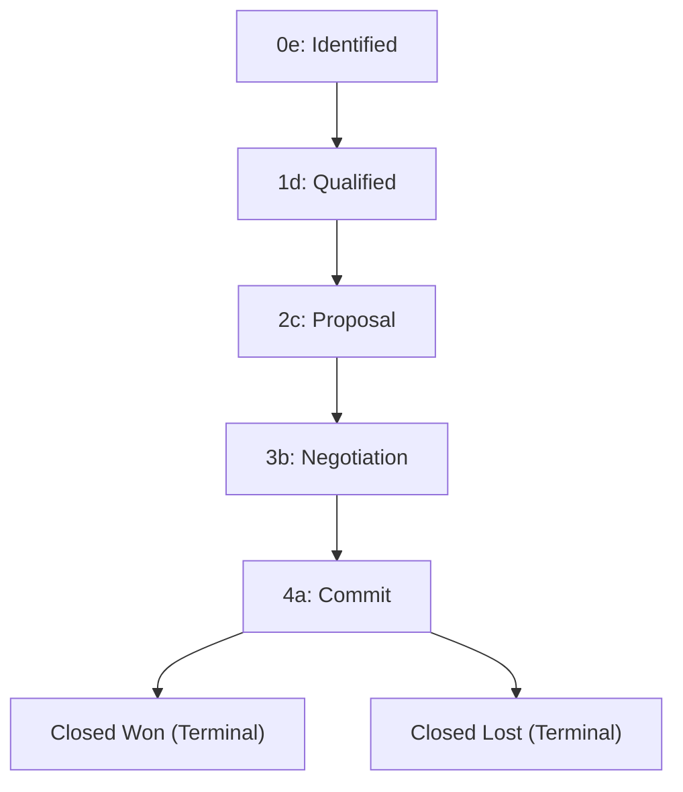

# Opportunities and sales funnel

Qualify a customer need and keep each sales pursuit at the right stage.

**New to these terms?** Read the [terminology reference](https://jienweng.gitbook.io/q-app/reference/terminology#opportunity).

## On this page

* [Record PPVVC](#the-ppvvc-qualification-framework)
* [Understand stages](#funnel-stages-and-lifecycle)
* [Change a stage](#stage-advancement-and-rollback-rules)

---

## The Opportunity Model

In Q-App, sales pursuits are managed through a structured two-tier structure:

* **Opportunity Container**: The top-level commercial record holding overall customer relationship context, PPVVC qualification, and target budget.
* **Funnel Deal**: The active sales pursuit tracking the exact deal stage, line items, quotations, costs, and closing timeline.

### Opportunity Codes
Every Opportunity is assigned a system-generated, immutable identifier:
`ORGCODEOPP-YYYY-NNNN`
*(Example: `QDTOPP-2026-0015`)*

This code remains constant throughout the deal lifecycle and links all quotations, contracts, and delivery projects together.

---

## The PPVVC Qualification Framework

To ensure consistent sales rigor, every Opportunity includes a dedicated **PPVVC** qualification panel:

| Pillar | Focus | What to Document |
| :--- | :--- | :--- |
| **Power Sponsor** | Authority & Budget | Who is the economic buyer with signature authority? Is this person actively supporting your proposal? |
| **Pain** | Business Problem | What specific business problem, bottleneck, or financial loss is the customer experiencing? |
| **Vision** | Agreed Solution | What solution design or strategic capability has been agreed upon with the customer? |
| **Value** | Quantifiable ROI | What is the measurable financial return, cost savings, or operational efficiency for the client? |
| **Control** | Process Governance | What influence do you have over their RFP timeline, decision criteria, and procurement approval milestones? |


Filling out the PPVVC panel regularly increases forecast accuracy and helps managers identify risk factors during pipeline reviews.


---

## Funnel Stages and Lifecycle

Deals progress through standard stages:

**Read the diagram:** the arrows show a typical progression. Available targets and required fields are shown in the stage-change dialog; the workflow does not require every deal to move one stage at a time.

### Stage Definitions

* **`0e` Identified**: Initial scoping after lead conversion or new pursuit creation.
* **`1d` Qualified**: Active stakeholder discussions and requirement gathering.
* **`2c` Proposal**: Technical and commercial feasibility assessment; drafting architecture.
* **`3b` Negotiation**: Formal proposal and quotation submitted to the client.
* **`4a` Commit**:
   * **Project Code Allocation**: The moment a deal enters stage `4a` for the first time, the system **automatically allocates the official Delivery Project Code**. This allows delivery managers to begin resource planning before final contract signature.
* **Closed Won** *(Terminal)*:
   * Contract executed and deal won.
   * **Automatic Action**: Sets live Planned payment milestones to `Won`; Invoiced milestones retain their status.
   * Locks the stage from further changes.
* **Closed Lost** *(Terminal)*:
   * Prospect decided against the purchase or chose a competitor.
   * Requires written **Lost reason (close remarks)**. Complete any other fields requested by your organization.

---

## Stage Advancement and Rollback Rules

* **Advancing Forward**: Advancing to a higher stage runs stage-gate verification (e.g., verifying PPVVC completeness, valid quotation presence, or required manager sign-off).
* **Rolling Backward**: Moving between open stages to an earlier stage skips forward-entry gates. Reopening a parked/KIV deal requires approval. You still need permission to change stages.
* **Terminal Stages**: Once an opportunity is marked **Closed Won** or **Closed Lost**, it cannot be moved to any other stage.

---

## Multi-Year Contracts and Deal Costs

Inside the Funnel detail page:

* **Contract Panel**: For multi-year service contracts, specify annual breakdown figures (Year 1, Year 2, Year 3 ARR) to support financial forecasting.
* **Costs Panel**: Record estimated third-party vendor costs, hardware procurement, or subcontractor fees to track gross margin before issuing quotes.

## Continue

* [Quotations & revisions](05-quotations-and-revisions.md)
* [Troubleshooting](help-center/troubleshooting.md)
* [Back to start](https://jienweng.gitbook.io/q-app)
