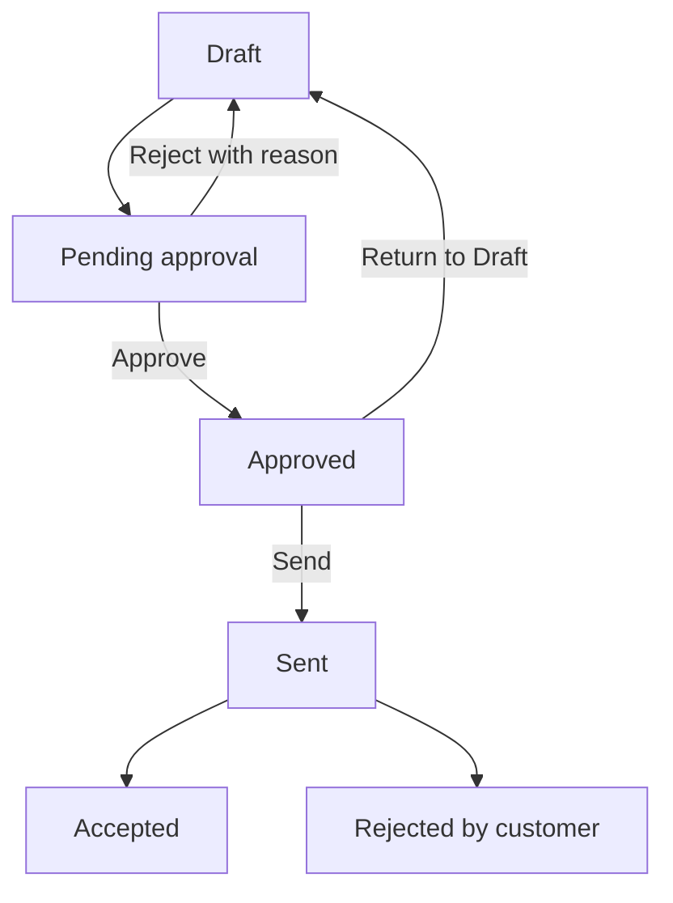

# Quotations and revisions

Prepare an offer, get approval, and manage customer changes.

**New to these terms?** Read the [terminology reference](https://jienweng.gitbook.io/q-app/reference/terminology#quotation).

## On this page

* [Create a quote](#creating-a-quotation)
* [Check approval status](#the-quotation-lifecycle)
* [Create a revision](#managing-revisions)
* [Print a PDF](#exporting-client-pdfs)

---

## What is a Quotation?

A **Quotation** is the formal commercial and legal proposal presented to the customer. It contains itemized pricing, tax breakdowns, delivery schedules, and payment terms.

---

## Creating a Quotation




#### Start a quotation

Open the target deal in **Sales → Funnel** and click **+ New Quotation** (or navigate to **Sales → Quotations** and click **+ New Quotation**).




#### Check linked records

The system automatically links the quote to the Opportunity, Account, and Account Currency.




### Check defaults before sending

Review payment terms, delivery notes, the recipient contact, currency, and tax before submitting the quote. Defaults help you prepare a draft; do not assume that every default becomes immutable at creation.


**Sending freezes the tax snapshot.** Draft labels can use the selected tax setting. When the quotation is sent, the applicable rate is captured so the sent quote no longer tracks later tax-setting changes.


---

## Adding Line Items and Product Pricing




#### Add a line item

In the **Line Items** section, click **+ Add Line Item**.




#### Choose a catalog product

**Select from Product Catalog**:

* Search for existing products by SKU or name. Selecting a product automatically populates its unit price, category, and tax eligibility.




#### Add custom items if needed

**Custom Line Items**:

* You can manually type custom service descriptions, deliverable milestones, or bespoke project scopes.




#### Review pricing

**Configure Pricing**:

* **Quantity**: Number of units/days/hours.
* **Unit Price**: Base price per unit in the account currency.
* **Discount (%)**: Optional percentage discount.
* **Tax Rate**: Applies tenant tax setting (e.g., 0% Exempt, 6%, 8% SST).




#### Check the totals

The system computes subtotal, total discount, tax amount, and final total in real time.




---

## Document Templates

Select the template appropriate for your offering:

* **Standard Proposal & Quotation**: Full commercial proposal layout suitable for software licenses, professional consulting, and managed services.
* **Quandatics Academy Template**: Formatted specifically for training courses, workshops, certification programs, and educational services.

---

## The Quotation Lifecycle

**Revision is a separate record:** an eligible historical quotation creates a new Draft copy. The original Sent or Accepted quote does not change back to Draft when you revise it.

### `Draft`
The sales rep drafts and edits line items, notes, and pricing.

### `Pending Approval`
A draft must be approved before it can be sent:

* Click **Submit for Approval**.
* The quote is locked against further edits and reviewed on the quotation by the first active manager in the account owner’s reporting line with **Approve quotations** permission. Only that eligible manager may approve or reject it. The **Approvals** module handles stage requests separately.
* If the account owner changes while approval is pending, the quotation returns to Draft with an explanation. The new owner must resubmit it.

### `Approved`
The eligible reporting manager approves the quote. A member with send permission can then record sending it. Rejection requires an explanation and returns it to Draft. These actions record audit events but do not send an email notification.

### `Sent`
Once delivered to the customer via email or formal meeting, use **Send** to record sending.

### `Accepted` or `Rejected`

* **Accepted**: The customer accepts the proposal. *(Note: Customer acceptance records commercial agreement; it does not automatically move the Funnel stage).*
* **Rejected**: The customer rejected the proposal.

---

## Managing Revisions

Customers often request scope adjustments or discount updates after a quote is sent.

**To create a revision:**




#### Open the source quotation

Open the existing sent or accepted quotation.




#### Create a revision

Use the revision action available on the quotation. Sent, Accepted, Rejected, Expired, and Void quotations are eligible historical states.




#### Review the new draft

The system executes the following:

* **Preserves Source**: The original quote remains permanently locked in history for compliance.
* **Creates Revision**: A new linked draft copy is created. Use its displayed quotation number when referring to the revision.
* You can freely modify line items and submit the revision through the approval flow.




---


**Approved or pending quote?** An approved quote can be returned to Draft, edited, and submitted for approval again. A pending quote must first be reviewed. The revision action is not available on live Pending Approval or Approved quotes.


## Exporting Client PDFs

Open **Preview** on the quotation:

* Generates a branded, publication-ready PDF proposal.
* Includes company branding, billing addresses, line items table, payment milestones, terms, and signature acceptance blocks.
* Open the quotation preview and use the print/PDF action. In the browser print dialog, choose **Save as PDF**, then check the saved file before sharing it.

## Continue

* [Payment milestones](06-payment-milestones.md)
* [Troubleshooting](help-center/troubleshooting.md)
* [Back to start](https://jienweng.gitbook.io/q-app)
