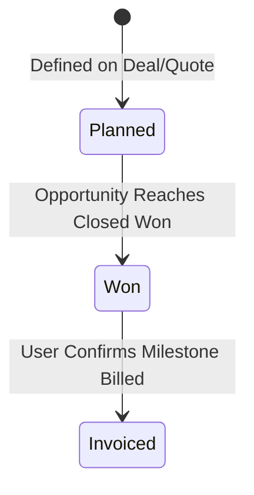

# Payment milestones

Plan billing events and record when confirmed milestones have been invoiced.

**New to these terms?** Read the [terminology reference](https://jienweng.gitbook.io/q-app/reference/terminology#payment-milestone).

## On this page

* [Set up milestones](#setting-up-milestones)
* [Understand statuses](#milestone-statuses)
* [Record billing](#managing-milestones)

---

## Purpose of Payment Milestones

**Payment Milestones** are commercial planning records that break down deal value into distinct billing events (e.g., *Deposit, Delivery, UAT Acceptance, Final Retainer*).


**Planning & Operational Role**: Payment milestones in Q-App serve as commercial billing indicators and cashflow planners. They are intentionally decoupled from automated ERP invoice generation, allowing finance teams to coordinate billing according to contractual milestones.


---

## Setting Up Milestones

Milestones are configured during quotation preparation or directly within the Funnel deal:




#### Open the deal or quotation

Open the target Funnel or Quotation.




#### Add a milestone

In the **Payment Milestones** section, click **+ Add Milestone**.




#### Enter billing-plan details

Specify:

* **Milestone Title**: e.g., *"1st Payment: 30% Advance Deposit upon PO"*.
* **Amount / Percentage**: Fixed currency amount or percentage of total deal value.
* **Expected Date**: Target billing date.
* **Trigger Condition**: e.g., *Contract Execution, UAT Sign-off, Go-Live*.




#### Save the milestone

Save the milestone.




---

## The Milestone Lifecycle

**Read the diagram:** Planned becomes Won automatically when the linked funnel closes Won. Won becomes Invoiced only when an authorized user records billing. Milestones created for an already won funnel start as Won.

### Milestone Statuses

| Status | Meaning | How it is Set |
| :--- | :--- | :--- |
| **`Planned`** | Draft or tentative milestone during proposal negotiations. | Set during initial creation. |
| **`Won`** | Confirmed planning milestone on a won deal. | **Automated**: The system marks live Planned milestones as **`Won`** when the linked funnel moves to **Closed Won**. Invoiced milestones retain their status. |
| **`Invoiced`** | The finance/operations team has issued the invoice to the customer for this phase. | **Manual**: The user updates the milestone status once billing is executed. |

---

## Managing milestones




#### Find the milestone

Open **Sales → Payment Milestones** to find the billing event and check its current status, amount, due date, and linked funnel.




#### Review the payment schedule

Open the linked funnel's **Payment Milestones** tab to review its payment schedule.




#### Edit supported planning fields

Users with milestone-management permission can edit supported planning fields. Amounts on an Invoiced milestone are locked.




#### Understand the billing transition

After billing, the supported manual status transition is **Won → Invoiced**. There is no reverse transition.





**Current interface limitation:** the milestone list, detail page, and shared payment schedule display status badges rather than a status-editing control in this repository version. If you need to record Invoiced and no action is available in your deployed version, contact your administrator or support team. Do not assume clicking the badge changes the status.


**Check the result:** confirm the status saved as Invoiced after an authorized update. Keep the invoice and billing reference in your billing system; a milestone status change does not issue an invoice or receipt.

## Continue

* [Troubleshooting](help-center/troubleshooting.md)
* [Back to start](https://jienweng.gitbook.io/q-app)
