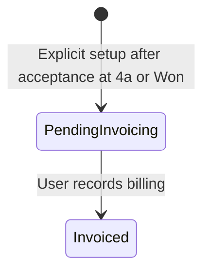

# Payment milestones

Plan billing events and record when confirmed milestones have been invoiced.

**New to these terms?** Read the [terminology reference](https://jienweng.gitbook.io/q-app/reference/terminology#payment-milestone).

## On this page

* [Set up milestones](#setting-up-milestones)
* [Understand statuses](#milestone-statuses)
* [Record billing](#managing-milestones)

---

## Purpose of Payment Milestones

**Payment Milestones** are commercial planning records that break down deal value into distinct billing events (e.g., *Deposit, Delivery, UAT Acceptance, Final Retainer*).


**Planning & Operational Role**: Payment milestones in Q-App serve as commercial billing indicators and cashflow planners. They are intentionally decoupled from automated ERP invoice generation, allowing finance teams to coordinate billing according to contractual milestones.


---

## Setting Up Milestones

Milestones are configured explicitly within the Funnel after its quotation is customer Accepted and its stage is 4a or Closed Won. The Payment Milestones tab is hidden below 4a and while the quotation is unaccepted.




#### Open the deal or quotation

Open the target Funnel or Quotation.




#### Add a milestone

In the **Payment Milestones** section, click **+ Add Milestone**.




#### Enter billing-plan details

Specify:

* **Milestone Title**: e.g., *"1st Payment: 30% Advance Deposit upon PO"*.
* **Amount**: A currency amount. Calculate a percentage into an amount before entering it; the shared schedule does not offer a percentage field.
* **Due date**: Target billing date.
* **Description**: Describe the billing condition, such as Contract Execution or UAT Sign-off. This is planning text, not an automated trigger.




#### Save the milestone

The shared schedule adds a row named **New milestone**; edit its title, description, due date, and amount inline and save each change.




---

## Creating a schedule and splitting

Stage changes, quotation changes, project creation and sales-order approval do not create milestones automatically. Eligible funnels without a schedule show **Payment schedule not configured**. Use **Create payment schedule** to enter at least two titled amounts totaling the full net quotation value, or add a single milestone directly. Set due dates after setup.

**Split payment** is available for one uninvoiced milestone matching the full current value. Invoiced milestones cannot be split.

## The Milestone Lifecycle

Closing the funnel Won does not change milestone status. Moving below 4a, to Lost or to On Hold hides the active schedule and blocks new invoicing. Historical invoiced milestones remain accessible from Sales → Payment Milestones under the usual ownership rules.

### Milestone Statuses

| Status | Meaning | How it is Set |
| :--- | :--- | :--- |
| **Pending invoicing** | An agreed payment milestone awaiting invoicing. | Explicit schedule creation. |
| **Invoiced** | The invoice has been issued for this phase. | An authorized user chooses **Mark invoiced**. |

Existing Planned/Won rows migrate to Pending invoicing without changing their amounts or invoice history. Ineligible legacy schedules remain stored but hidden until eligible; review the agreed amounts before invoicing.

---

## Managing milestones




#### Find the milestone

Open **Sales → Payment Milestones** to find the billing event and check its current status, amount, due date, and linked funnel.




#### Review the payment schedule

Open the linked funnel's **Payment Milestones** tab to review its payment schedule.




#### Edit supported planning fields

Users with milestone-management permission can edit supported planning fields. Amounts on an Invoiced milestone are locked.




#### Understand the billing transition

After billing, the supported manual status transition is **Pending invoicing → Invoiced**. There is no reverse transition.





**Current interface limitation:** the milestone list, detail page, and shared payment schedule display status badges rather than a status-editing control in this repository version. If you need to record Invoiced and no action is available in your deployed version, contact your administrator or support team. Do not assume clicking the badge changes the status.


**Check the result:** confirm the status saved as Invoiced after an authorized update. Keep the invoice and billing reference in your billing system; a milestone status change does not issue an invoice or receipt.

## Continue

* [Troubleshooting](help-center/troubleshooting.md)
* [Back to start](https://jienweng.gitbook.io/q-app)
