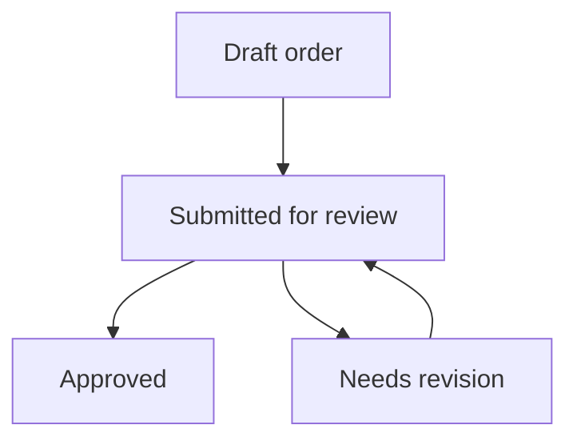

# Delivery projects and sales orders

Check the sales handover and manage customer order records.

**New to these terms?** Read the [terminology reference](https://jienweng.gitbook.io/q-app/reference/terminology#sales-order).

## On this page

* [Manage projects](#creating-and-managing-projects)
* [Submit an order](#submitting-a-sales-order)
* [Review an order](#order-review-and-approval)

---

## 1. Delivery Projects (`/projects`)

Once a deal advances toward closing, sales commitments transition into delivery execution.

### Automatic Project Code Allocation

* When an Opportunity first advances to stage **`4a` (Commit)**, the system automatically allocates the official **Project Code** (e.g., `PRJ-2026-0038`).
* This enables technical leads, delivery managers, and resource planners to prepare project timelines prior to final contract execution.

### Creating and Managing Projects




#### Open Projects

Navigate to **Sales → Projects** in the sidebar.




#### Start or open a project

Click **+ New Project** (or open a project generated from a won opportunity).




#### Complete project details

Specify project parameters:

* **Project Name**: Title of the implementation or service engagement.
* **Project Code**: Matches the allocated code.
* **Account & Funnel**: Associated customer organization and originating sales deal.
* **Project Manager**: Assigned delivery owner.
* **Start Date & Target Completion Date**: Estimated timeline.
* **Delivery Status**: `Active`, `On Hold`, or `Completed`.




#### Save the project

Click **Save Project**.




---

## 2. Sales Orders (`/sales-orders`)

A **Sales Order** records the formal customer Purchase Order (PO) or signed contract that authorizes delivery.

### The Sales Order Workflow

**Read the diagram:** a submitted order is reviewed before approval. If changes are requested, correct the order and resubmit it. A reviewer may also reject an order when it should not proceed. Check the actual status in your workspace before taking the next action.

### Submitting a Sales Order




#### Open Sales Orders

Navigate to **Sales → Sales Orders** and click **+ Submit Sales Order** (or create directly from the Project or Quotation page).




#### Enter order details

Fill in the order verification details:

* **Customer PO Number**: The reference number printed on the customer's official purchase order.
* **PO Date**: Date of issue from the customer.
* **Associated Quotation**: Links the order to the approved quotation and line items.
* **Total Order Value**: Confirmed contract amount.
* **Document Attachment**: Upload a scan of the signed customer PO or contract document.
* **Delivery Notes**: Any specific customer delivery prerequisites or billing requirements.




#### Submit the order

Click **Submit Order**.




### Order Review and Approval

* Orders with status **`Submitted`** appear in the sales order review queue.
* Managers or operations administrators verify that the customer PO details match the approved quotation.
* Upon confirmation, the status updates to **`Approved`**, authorizing procurement and resource deployment.

## Continue

* [Stage approvals](08-approvals-inbox.md)
* [Troubleshooting](help-center/troubleshooting.md)
* [Back to start](https://jienweng.gitbook.io/q-app)
