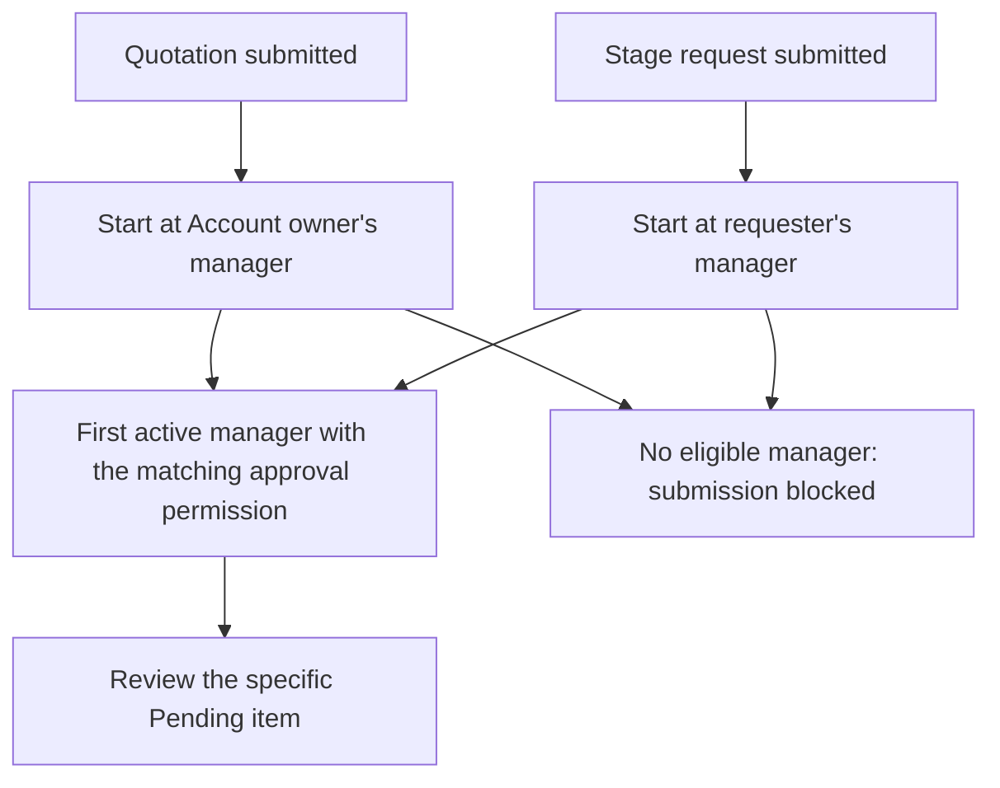

# Permissions and approval routing

Access depends on your active organization, assigned permissions, record scope, and enabled modules. Role names and seniority tiers alone do not determine approval eligibility.

## What controls access?

| Control | What it affects |
| --- | --- |
| Active organization | The workspace whose records and settings you are using. |
| Assigned roles and permissions | Which modules and actions you are allowed to use. Permissions from assigned roles count together. |
| Record ownership and reporting relationships | Which records you can see or manage when access is scoped. |
| Enabled modules | Whether a feature is available for the organization. |

Sales roles see only records they own. Managers also see records owned by their reporting team through **View own and reporting team records**. Approval permission alone does not grant team visibility. Explicit view-all grants still apply.

The **Owner** role is different from ownership of an account or funnel. See [Terminology](terminology.md#owner-salesperson-and-reporting-manager).

## Who approves a quotation?

The app starts from the **Account owner's reporting line** and finds the first active manager with **Approve quotations** permission. Only that eligible manager can approve or reject the quotation, subject to the platform superadmin's operational override. An Account owner cannot approve their own quotation.

Every quote needs approval before sending. Review happens on the quotation page, not in the stage-request inbox. Rejection requires a reason and returns the quote to Draft. See [Quotation lifecycle](https://jienweng.gitbook.io/q-app/docs/sales/05-quotations-and-revisions#the-quotation-lifecycle).

## Who approves a stage request?

The app starts from the **requester's reporting line** and finds the first active manager with **Approve stage advances** permission. Only the assigned manager who remains eligible can decide the request, subject to the platform superadmin's operational override. A requester cannot approve their own request.

Stage approvers can enter gated stages directly using their stage-approval capability. Other users follow the request process when a stage requires approval. See [Stage approvals](https://jienweng.gitbook.io/q-app/docs/sales/08-approvals-inbox).

## Routing examples

Suppose Sam owns the Account, Sam reports to Maya, and Maya reports to Lee.

* If Maya is active and has **Approve quotations**, Maya reviews Sam's quotation. If Maya lacks that permission, the app checks Lee next. Lee can review only if active and permitted. A different administrator outside this reporting line is not selected just because they have an administrative role.
* If Alex submits a stage request on an accessible funnel, the request follows **Alex's** reporting line, even when Sam owns the Account. The quotation still follows Sam's line.
* Quotation approval does not bypass its Draft → Pending Approval → Approved process merely because the person preparing it is a manager. For stage movement, users with **Approve stage advances** can make gated transitions directly, subject to stage requirements.

The matching permission differs between the two routes. One person may qualify for quotation approval but not stage approval. For a stage request, the reviewer must also match the stored assignment when deciding. For a quotation, the app checks the owner's current eligible manager at decision time.

## Check the version before approval

Approval applies to the submitted quotation number/version. A separate revision starts Draft and must be approved separately. Returning an Approved quote to Draft clears its approval. Read [Documents, actions, and approval](documents-and-actions.md#which-version-is-approved) before deciding from a PDF or historical quotation.

## What if the manager changes?

Changing the Account owner cancels pending stage requests and returns pending quotations to Draft. The new owner resubmits them to route each request to the current eligible manager. If no eligible manager exists, submission asks for the reporting line and approval permission to be configured instead of routing to an unrelated approver.

Ask your administrator to check **Team and roles**. Managing team membership requires **Manage users**; changing organization defaults requires **Manage tenant settings**. Owner and Admin receive these permissions by default, and custom roles can provide different grants. Default System roles remain fixed.

## Configure member roles

Use [Roles and RBAC](https://jienweng.gitbook.io/q-app/docs/administration/roles-and-rbac) for the default-role comparison and configuration steps. Multiple roles add permissions; a restrictive role does not subtract another role’s grants.

## A missing action

Use [Missing modules or records](https://jienweng.gitbook.io/q-app/docs/help/troubleshooting#a-module-button-or-record-is-missing) to check your active organization, filters, permissions, and module availability.

## Continue

* [Administration and settings](https://jienweng.gitbook.io/q-app/docs/administration/09-admin-and-settings)
* [Terminology](terminology.md)
* [Documentation overview](https://jienweng.gitbook.io/q-app/docs)
