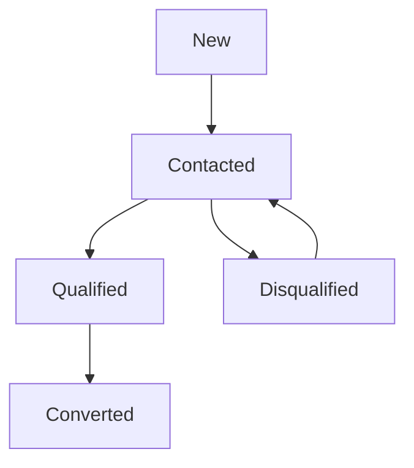
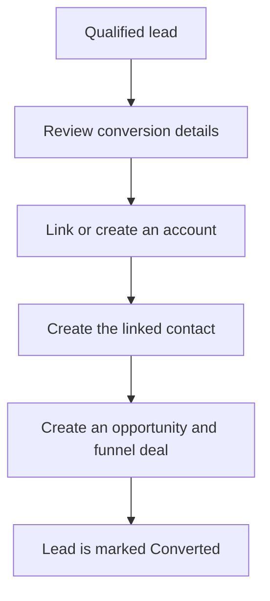
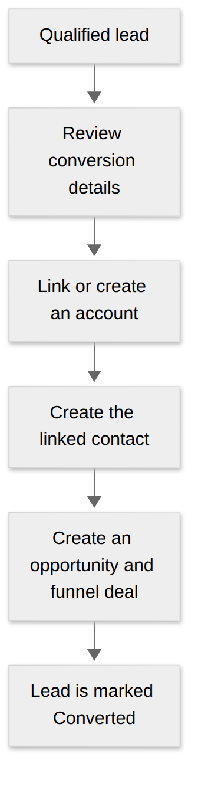

# Leads and conversion

Capture prospects, qualify them, and convert the right leads.

## On this page

* [Create a lead](#creating-a-lead)
* [Understand statuses](#lead-statuses)
* [Convert a lead](#converting-a-lead)

---

## What is a Lead?

A **Lead** represents an unverified inbound expression of interest (e.g., from a web form, event booth, partner referral, or cold outreach). It serves as a staging area to qualify prospects without cluttering your core accounts and active sales pipeline.

---

## Creating a Lead

1. Navigate to **CRM → Leads** in the left sidebar.
2. Click the **+ New Lead** button in the top right corner.
3. Fill in the lead information:
   * **Contact Name**: First Name and Last Name.
   * **Company Name**: The prospective organization name.
   * **Email & Phone**: Primary communication channels.
   * **Lead Source**: Where the lead originated (e.g., *Website, Referral, Event, Cold Outreach*).
   * **Estimated Value**: Anticipated initial deal size.
   * **Owner**: The sales representative assigned to nurture the lead (defaults to you).
   * **Notes**: Any initial context or background details.
4. Click **Create Lead**.

---

## The Lead Lifecycle

**Read the diagram:** a lead moves through outreach and qualification before conversion. A lead can also be disqualified before qualification, then restored to Contacted when it is worth pursuing again.

### Lead Statuses

* **`New`**: Newly received lead awaiting initial review.
* **`Contacted`**: Outreach has commenced (email sent, call made, meeting scheduled).
* **`Qualified`**: The prospect has verified need, budget, and authority.
* **`Disqualified`**: The prospect is not a fit for your services.

### Handling Disqualification
When marking a lead as **Disqualified**:
1. You must select a structured **Disqualification Reason** (e.g., *No Budget, Out of Scope, Competitor Chosen, Unresponsive*).
2. Enter explanatory notes to help your team analyze lost lead patterns.
3. **Restoring a Disqualified Lead**: If a disqualified prospect contacts you again months later, you can click **Restore to Contacted** on the lead detail view to re-enter the active qualification cycle.

---

## Converting a lead

Once a lead has been qualified and is ready for a commercial proposal, convert it using the **Conversion Wizard**. Add a valid email to the lead before converting; the new contact requires one.

**Result:** the converted lead links to the customer records and sales pursuit. Review account matching and currency before confirming; the same lead cannot be converted twice.

View a static copy of the conversion flow

<figure><figcaption>
Lead conversion creates linked records; it is not a status change alone.
</figcaption></figure>

### Step-by-step conversion
1. Open the Lead detail page.
2. Click the **Convert Lead** button in the top action bar.
3. You will be redirected to the full-page conversion wizard:
   * **Account Section**:
     * **Link Existing Account**: The wizard scans your database for matching company names. If a match is found, you can link to the existing Account.
     * **Create New Account**: If no match exists, select `Create New Account`. Specify the Account Type (*Client* or *Reseller*), Account Code, and Address.
   * **Contact Section**:
     * Automatically creates a new Contact record pre-filled with the lead's name, email, and phone number, associated with the Account.
   * **Opportunity & Funnel Section**:
     * **Opportunity Name**: Defaults to `[Company Name] opportunity` (customizable).
     * **Expected Close Date**: Set the estimated closing target date.
     * The deal is automatically seeded into the sales funnel at the initial stage **`0e` (Identified)**.
4. Click **Convert lead**.


**Review before converting.** Conversion creates linked records and marks the lead Converted. You cannot convert the same lead again.


## Continue

* [Accounts & contacts](03-accounts-and-contacts.md)
* [Troubleshooting](help-center/troubleshooting.md)
* [Back to start](README.md)
