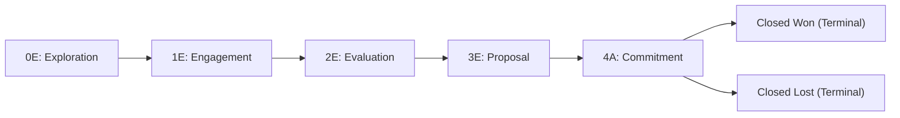

# 4. Opportunities & Sales Funnel

This chapter covers opportunity management, the PPVVC qualification framework, funnel stages, stage-gate automation, and project code allocation.

---

## The Opportunity Model

In Q-App, sales pursuits are managed through a structured two-tier structure:
1. **Opportunity Container**: The top-level commercial record holding overall customer relationship context, PPVVC qualification, and target budget.
2. **Funnel Deal**: The active sales pursuit tracking the exact deal stage, line items, quotations, costs, and closing timeline.

### Opportunity Codes
Every Opportunity is assigned a system-generated, immutable identifier:
$$\text{ORGCODEOPP-YYYY-NNNN}$$
*(Example: `QDTOPP-2026-0015`)*

This code remains constant throughout the deal lifecycle and links all quotations, contracts, and delivery projects together.

---

## The PPVVC Qualification Framework

To ensure consistent sales rigor, every Opportunity includes a dedicated **PPVVC** qualification panel:

| Pillar | Focus | What to Document |
| :--- | :--- | :--- |
| **Power Sponsor** | Authority & Budget | Who is the economic buyer with signature authority? Is this person actively supporting your proposal? |
| **Pain** | Business Problem | What specific business problem, bottleneck, or financial loss is the customer experiencing? |
| **Vision** | Agreed Solution | What solution design or strategic capability has been agreed upon with the customer? |
| **Value** | Quantifiable ROI | What is the measurable financial return, cost savings, or operational efficiency for the client? |
| **Control** | Process Governance | What influence do you have over their RFP timeline, decision criteria, and procurement approval milestones? |

> [!TIP]
> Filling out the PPVVC panel regularly increases forecast accuracy and helps managers identify risk factors during pipeline reviews.

---

## Funnel Stages & Lifecycle

Deals progress through standard stages:

### Stage Definitions

1. **`0E` Exploration**: Initial scoping after lead conversion or new pursuit creation.
2. **`1E` Engagement / Identification**: Active stakeholder discussions and requirement gathering.
3. **`2E` Evaluation**: Technical and commercial feasibility assessment; drafting architecture.
4. **`3E` Solution / Proposal**: Formal proposal and quotation submitted to the client.
5. **`4A` Commitment / Negotiation**:
   * **Project Code Allocation**: The moment a deal enters stage `4A` for the first time, the system **automatically allocates the official Delivery Project Code**. This allows delivery managers to begin resource planning before final contract signature.
6. **Closed Won** *(Terminal)*:
   * Contract executed and deal won.
   * **Automatic Action**: Sets all live payment milestones to `Won`.
   * Locks the stage from further changes.
7. **Closed Lost** *(Terminal)*:
   * Prospect decided against the purchase or chose a competitor.
   * Requires selecting the **Lost Reason** and the **Winning Competitor**.

---

## Stage Advancement & Rollback Rules

* **Advancing Forward**: Advancing to a higher stage runs stage-gate verification (e.g., verifying PPVVC completeness, valid quotation presence, or required manager sign-off).
* **Rolling Backward**: You can roll back to any prior non-terminal stage (e.g., from `3E` back to `2E`) without restrictions if negotiations require re-scoping.
* **Terminal Stages**: Once an opportunity is marked **Closed Won** or **Closed Lost**, it cannot be moved to any other stage.

---

## Multi-Year Contracts & Deal Costs

Inside the Funnel detail page:
* **Contract Panel**: For multi-year service contracts, specify annual breakdown figures (Year 1, Year 2, Year 3 ARR) to support financial forecasting.
* **Costs Panel**: Record estimated third-party vendor costs, hardware procurement, or subcontractor fees to track gross margin before issuing quotes.
