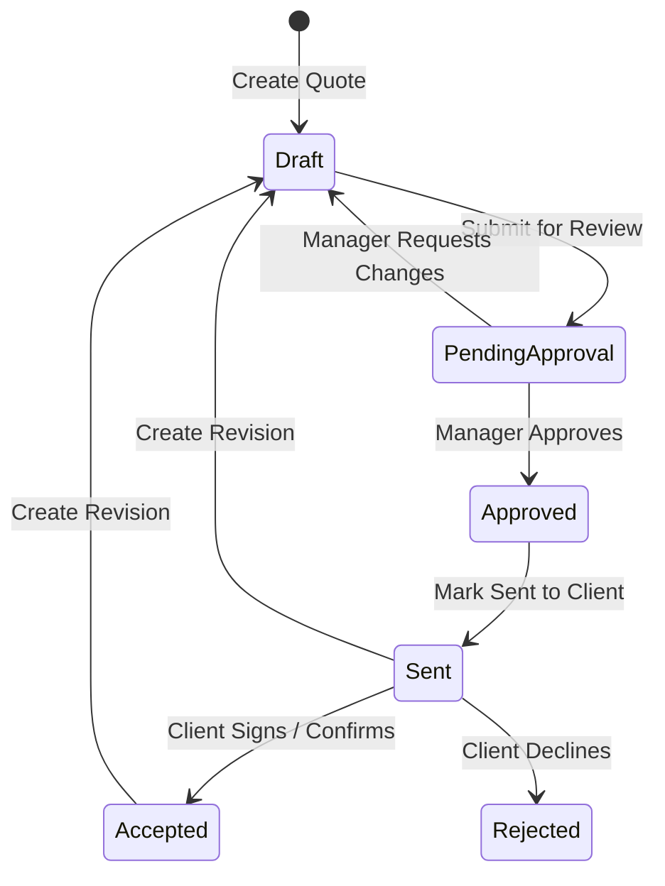

# 5. Quotations & Revisions

This chapter covers creating quotations, selecting catalog products, configuring tax and snapshot terms, navigating approval workflows, managing revisions, and exporting client PDFs.

---

## What is a Quotation?

A **Quotation** is the formal commercial and legal proposal presented to the customer. It contains itemized pricing, tax breakdowns, delivery schedules, and payment terms.

---

## Creating a Quotation

1. Open the target deal in **Sales → Funnel** and click **+ New Quotation** (or navigate to **Sales → Quotations** and click **+ New Quotation**).
2. The system automatically links the quote to the Opportunity, Account, and Account Currency.

### Automatic Snapshotting
When a quotation is initialized, the system automatically captures editable initial snapshots of:
* **Payment Terms**: Copied from Organization Settings (e.g., *30 Days Net, 50% Upfront*).
* **Delivery Notes**: Default delivery and SLA terms.
* **Attention**: Default primary contact from the Account.
* **Tax Settings**: Applicable tax rates (e.g., *SST 8% / Tax Inclusive vs. Tax Exclusive*).

> [!NOTE]
> **Snapshot Safety**: If organization settings are modified later, existing quotations remain unchanged to preserve legal and contractual integrity.

---

## Adding Line Items & Product Pricing

1. In the **Line Items** section, click **+ Add Line Item**.
2. **Select from Product Catalog**:
   * Search for existing products by SKU or name. Selecting a product automatically populates its unit price, category, and tax eligibility.
3. **Custom Line Items**:
   * You can manually type custom service descriptions, deliverable milestones, or bespoke project scopes.
4. **Configure Pricing**:
   * **Quantity**: Number of units/days/hours.
   * **Unit Price**: Base price per unit in the account currency.
   * **Discount amount**: Optional absolute discount amount.
   * **Tax Rate**: Applies tenant tax setting (e.g., 0% Exempt, 6%, 8% SST).
5. The system computes subtotal, total discount, tax amount, and final total in real time.

---

## Document Templates

Select the template appropriate for your offering:
* **Standard Proposal & Quotation**: Full commercial proposal layout suitable for software licenses, professional consulting, and managed services.
* **Quandatics Academy Template**: Formatted specifically for training courses, workshops, certification programs, and educational services.

---

## The Quotation Lifecycle

### 1. `Draft`
The sales rep drafts and edits line items, notes, and pricing.

### 2. `Pending Approval`
Every quotation must be approved before sending. Click **Submit for Approval**. The quotation becomes read-only, and the first active manager in the account salesperson’s reporting line with **Approve quotations** permission reviews it on the quotation page. Quotations are not listed in the funnel-stage Approvals inbox.

### 3. `Approved`
Only that eligible reporting manager may approve or reject the quotation. Rejection requires an explanation and returns it to Draft. Approval allows a member with send permission to mark it Sent. To edit an Approved quotation, return it to Draft and obtain approval again. These actions do not send an email notification.

### 4. `Sent`
Once delivered to the customer via email or formal meeting, click **Mark as Sent**.

### 5. `Accepted` or `Rejected`
* **Accepted**: The customer accepts the proposal. *(Note: Customer acceptance records commercial agreement; it does not automatically move the Funnel stage).*
* **Rejected**: The proposal was rejected.

---

## Managing Revisions

Customers often request scope adjustments or discount updates after a quote is sent.

**To create a revision:**
1. Open the existing sent or accepted quotation.
2. Click the **Revise** button in the header.
3. The system executes the following:
   * **Preserves Source**: The original quote remains permanently locked in history for compliance.
   * **Creates Revision**: A new draft copy is created with an incremented revision identifier (e.g., `QDT-2026-0042-Rev1`).
   * You can freely modify line items and submit the revision through the approval flow.

---

## Exporting Client PDFs

Click the **Preview / PDF** button on any quotation:
* Generates a branded, publication-ready PDF proposal.
* Includes company branding, billing addresses, line items table, payment milestones, terms, and signature acceptance blocks.
* Click **Download PDF** to save the file for client delivery.
