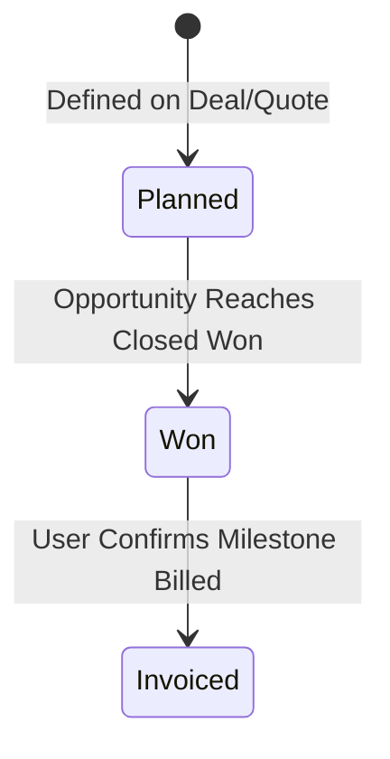

# 6. Payment Milestones

This chapter covers commercial payment milestones, cashflow planning, automated status triggers upon deal closure, and tracking billing completion.

---

## Purpose of Payment Milestones

**Payment Milestones** are commercial planning records that break down deal value into distinct billing events (e.g., *Deposit, Delivery, UAT Acceptance, Final Retainer*).

> [!NOTE]
> **Planning & Operational Role**: Payment milestones in Q-App serve as commercial billing indicators and cashflow planners. They are intentionally decoupled from automated ERP invoice generation, allowing finance teams to coordinate billing according to contractual milestones.

---

## Setting Up Milestones

Milestones are configured during quotation preparation or directly within the Funnel deal:

1. Open the target Funnel or Quotation.
2. In the **Payment Milestones** section, click **+ Add Milestone**.
3. Specify:
   * **Milestone Title**: e.g., *"1st Payment: 30% Advance Deposit upon PO"*.
   * **Amount / Percentage**: Fixed currency amount or percentage of total deal value.
   * **Expected Date**: Target billing date.
   * **Trigger Condition**: e.g., *Contract Execution, UAT Sign-off, Go-Live*.
4. Save the milestone.

---

## The Milestone Lifecycle

### Milestone Statuses

| Status | Meaning | How it is Set |
| :--- | :--- | :--- |
| **`Planned`** | Draft or tentative milestone during proposal negotiations. | Set during initial creation. |
| **`Won`** | Legally binding milestone on a committed deal. | **Automated**: The system automatically marks all live milestones as **`Won`** the moment the parent Opportunity moves to **Closed Won**. |
| **`Invoiced`** | The finance/operations team has issued the invoice to the customer for this phase. | **Manual**: The user updates the milestone status once billing is executed. |

---

## Managing Milestones in the Interface (`/payment-milestones`)

1. Navigate to **Sales → Payment Milestones** in the sidebar.
2. Review the consolidated list across all accounts:
   * View Milestone Title, Linked Funnel Deal, Quote Number, Amount, Expected Date, and Status.
3. **Marking a Milestone as Invoiced**:
   * When a deliverable is met and an invoice is issued to the client:
   * Open the milestone detail or use the row action menu.
   * Transition the status from **`Won`** to **`Invoiced`**.
   * Enter the invoice date and reference number for internal records.

> [!IMPORTANT]
> **Status Transition Rules**: A milestone can only move from **`Won`** to **`Invoiced`**. It cannot be reverted once marked invoiced, ensuring clean financial and audit consistency.
