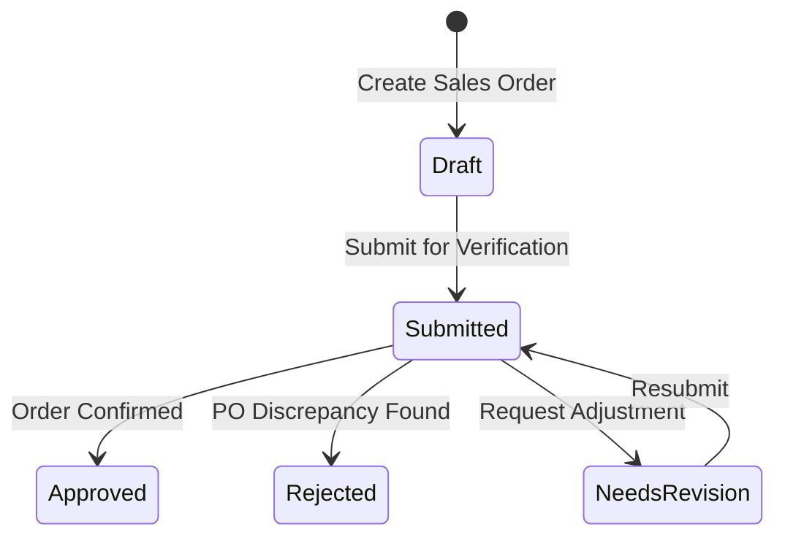

# 7. Delivery Projects & Sales Orders

This chapter covers post-sales execution: managing delivery projects and logging confirmed customer sales orders.

---

## 1. Delivery Projects (`/projects`)

Once a deal advances toward closing, sales commitments transition into delivery execution.

### Automatic Project Code Allocation
* When an Opportunity first advances to stage **`4a` (Commit)**, the system automatically allocates the official **Project Code** (e.g., `PRJ-2026-0038`).
* This enables technical leads, delivery managers, and resource planners to prepare project timelines prior to final contract execution.

### Creating and Managing Projects
1. Navigate to **Sales → Projects** in the sidebar.
2. Click **+ New Project** (or open a project generated from a won opportunity).
3. Specify project parameters:
   * **Project Name**: Title of the implementation or service engagement.
   * **Project Code**: Matches the allocated code.
   * **Account & Funnel**: Associated customer organization and originating sales deal.
   * **Project Manager**: Assigned delivery owner.
   * **Start Date & Target Completion Date**: Estimated timeline.
   * **Delivery Status**: `Active`, `On Hold`, or `Completed`.
4. Click **Save Project**.

---

## 2. Sales Orders (`/sales-orders`)

A **Sales Order** records the formal customer Purchase Order (PO) or signed contract that authorizes delivery.

### The Sales Order Workflow

### Submitting a Sales Order
1. Navigate to **Sales → Sales Orders** and click **+ Submit Sales Order** (or create directly from the Project or Quotation page).
2. Fill in the order verification details:
   * **Customer PO Number**: The reference number printed on the customer's official purchase order.
   * **PO Date**: Date of issue from the customer.
   * **Associated Quotation**: Links the order to the approved quotation and line items.
   * **Total Order Value**: Confirmed contract amount.
   * **Document Attachment**: Upload a scan of the signed customer PO or contract document.
   * **Delivery Notes**: Any specific customer delivery prerequisites or billing requirements.
3. Click **Submit Order**.

### Order Review & Approval
* Orders with status **`Submitted`** appear in the sales order review queue.
* Managers or operations administrators verify that the customer PO details match the approved quotation.
* Upon confirmation, the status updates to **`Approved`**, authorizing procurement and resource deployment.
