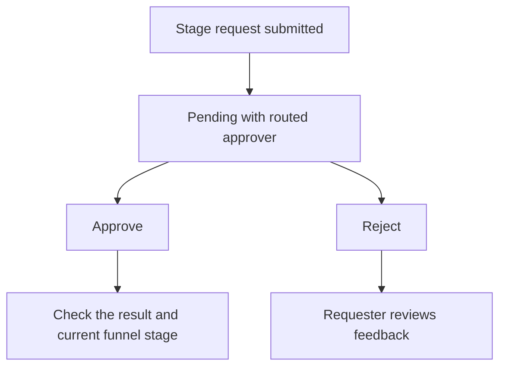

# Stage approvals

Use **Sales → Approvals** to review requests to change a funnel stage. Quotation approval is handled on the quotation itself; see [Quotation approvals](05-quotations-and-revisions.md#the-quotation-lifecycle).

## On this page

* [Find your requests](#find-your-requests)
* [Review and decide](#review-and-decide)
* [Follow up after a decision](#follow-up-after-a-decision)


**Who can use this page?** People with stage-change or stage-approval permissions can participate. Requests route to the first active manager in the requester’s reporting line with stage-approval permission. Only the assigned manager who remains eligible can decide the request; requesters cannot approve their own request. Permissions from all assigned roles count. Platform superadmins retain an operational override.


## Find your requests

1. Open **Sales → Approvals**.
2. Choose **Incoming** for pending requests routed to you.
3. Choose **My requests** to track requests you submitted.
4. Use **Previous** and **Next** to navigate the selected tab’s 25-request pages. Use **Review quotations** to open the separate quotation list.

An empty Incoming tab means no pending requests are currently routed to you; it does not show every request in the organization.

## Review and decide

1. Find the request and check the funnel name, current stage, and requested target stage.
2. Review the supporting context. Expand **Attachments** when supporting files are available.
3. Choose **Approve** or **Reject**.
4. Add a decision note. The stage-approval dialog makes this optional, but a clear reason helps the requester follow up.
5. Confirm the decision and read the result message.

**Read the diagram:** approval processes the requested stage change. Rejection leaves the requester to review the feedback and correct or reconsider the request. If the deal has already moved, the app may report the request as obsolete.

## Follow up after a decision

* **Approved:** open the funnel and verify the resulting stage. Read any message about an obsolete request before assuming the stage changed.
* **Rejected:** review the decision note, resolve the issue, and submit a new request if needed.
* **No longer needed:** requesters can cancel their pending request where the action is available.
* **Reporting manager changed:** cancel and resubmit a stale pending request so it routes to the current eligible manager.
* **No eligible manager:** ask your administrator to configure the reporting line and approval permissions. Submission does not route to an unrelated approver.

## Quotation approvals

Every quotation requires approval before sending. The eligible approver is the first active manager in the account salesperson’s reporting line with **Approve quotations** permission. Only that manager can approve or reject; a rejection requires a reason. These actions record audit events but do not send email notifications.

See [Quotation lifecycle](05-quotations-and-revisions.md#the-quotation-lifecycle).

## Continue

* [Opportunities & sales funnel](04-opportunities-and-funnel.md)
* [Quotations & revisions](05-quotations-and-revisions.md)
* [Troubleshooting](help-center/troubleshooting.md)
