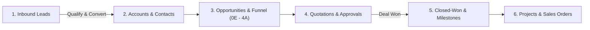

# Super-ERP Documentation Portal

Welcome to the central user guide and operational hub for **Super-ERP (Quandatics CRM v2)**. This portal provides end-to-end instructions for sales representatives, managers, delivery leads, and administrators to manage the complete lead-to-cash lifecycle.

---

### Explore by Area

<table data-view="cards">
  <thead>
    <tr>
      <th></th>
      <th></th>
      <th></th>
      <th data-hidden data-card-target data-type="content-ref"></th>
    </tr>
  </thead>
  <tbody>
    <tr>
      <td><h4>⚡</h4></td>
      <td><h4>Quick Start by Role</h4></td>
      <td>Role-based "Day in the Life" workflows for Reps, Managers, PMs, and Admins.</td>
      <td><a href="quick-start.md">Quick Start by Role</a></td>
    </tr>
    <tr>
      <td><h4>📖</h4></td>
      <td><h4>Product Documentation</h4></td>
      <td>Comprehensive field-by-field guides across all 9 core operational modules.</td>
      <td><a href="01-workspace-and-views.md">Product Guide</a></td>
    </tr>
    <tr>
      <td><h4>❓</h4></td>
      <td><h4>Help Center & FAQ</h4></td>
      <td>Instant answers to everyday questions and troubleshooting common blockers.</td>
      <td><a href="help-center/faqs.md">Help Center</a></td>
    </tr>
    <tr>
      <td><h4>📣</h4></td>
      <td><h4>What's New (Changelog)</h4></td>
      <td>Latest feature releases, quotation templates, and system enhancements.</td>
      <td><a href="changelog.md">Changelog</a></td>
    </tr>
  </tbody>
</table>

---

## The End-to-End Business Lifecycle

Super-ERP connects sales, delivery, and commercial planning through an automated, stage-gated lifecycle:


**Stage 4A Automation**: The moment a deal enters stage **4A (Commitment)** for the first time, the system automatically allocates the official **Delivery Project Code**, allowing technical teams to begin scoping before final contract signature.


---

## Core Operational Domains

| Domain | Modules | Primary Capabilities |
| :--- | :--- | :--- |
| **CRM** | **Leads**, **Accounts**, **Contacts** | Capture inbound interest, maintain customer records with required ISO currencies, and convert leads in one click. |
| **Sales** | **Opportunities**, **Funnel**, **Quotations** | Qualify deals with **PPVVC**, advance pipeline stages (`0E` to `4A`), manage line items, SST taxes, and proposal revisions. |
| **Delivery & Cash** | **Payment Milestones**, **Projects**, **Sales Orders** | Track commercial billing milestones (`Won` ➔ `Invoiced`), manage delivery projects, and verify customer Purchase Orders. |
| **Governance** | **Approvals**, **Team & Roles**, **Settings** | Centralized manager approval inbox, 4-tier RBAC access, custom taxonomies, and immutable audit trails. |

---

## Need Assistance?

* If you are stuck on an error or unexpected validation check, visit the [Troubleshooting Guide](help-center/troubleshooting.md).
* For quick answers to common operational questions, browse the [Frequently Asked Questions](help-center/faqs.md).
