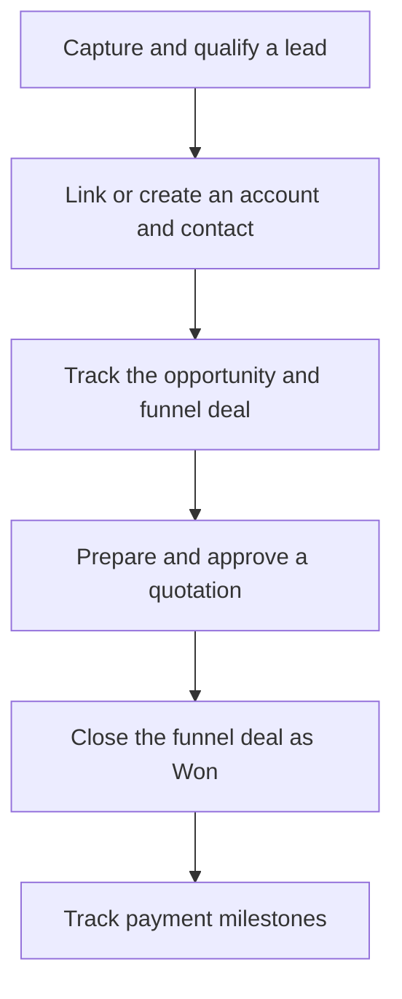

# Welcome to Q-App

Q-App brings customer records, sales pursuits, quotations, and payment milestones into one workspace. This guide covers the Base modules and Advanced Roles enabled for the current rollout. This is your starting point for learning the app and finding answers while you work.

## Choose your next step

<table data-view="cards"><thead><tr><th>Guide</th><th>Description</th><th data-hidden data-card-target data-type="content-ref">Link</th></tr></thead><tbody><tr><td><strong>Get started</strong></td><td>Follow a short checklist for sales, approvers, or administration.</td><td><a href="quick-start.md">Quick start by role</a></td></tr><tr><td><strong>Read the documentation</strong></td><td>Find a task guide for each module, with steps and workflow explanations.</td><td><a href="https://jienweng.gitbook.io/q-app/docs">Documentation overview</a></td></tr><tr><td><strong>Look up a term</strong></td><td>Understand accounts, opportunities, PPVVC, quotations, and billing terms.</td><td><a href="https://jienweng.gitbook.io/q-app/reference/terminology">Terminology</a></td></tr><tr><td><strong>See what changed</strong></td><td>Read product changes and documentation updates.</td><td><a href="https://jienweng.gitbook.io/q-app/changelog">Product changelog</a></td></tr></tbody></table>

## First time here?




#### Find your workspace

Sign in and check the active organization. Read [Workspace and personal views](01-workspace-and-views.md) to find the modules and list controls.




#### Choose your workflow

Open [Quick start by role](quick-start.md) and follow the checklist closest to your daily work.




#### Learn as you work

Use the [Documentation overview](https://jienweng.gitbook.io/q-app/docs) for detailed tasks and [Terminology](https://jienweng.gitbook.io/q-app/reference/terminology) for unfamiliar words. The [Stages and statuses](https://jienweng.gitbook.io/q-app/reference/stages-and-statuses) reference explains what each label means.





**Cannot find a button or module?** Check your active organization. Your permissions and enabled modules determine what appears. See [Permissions and approval routing](https://jienweng.gitbook.io/q-app/reference/permissions-and-approvals) or ask your administrator.


## How the workflow fits together

This is an overview of the usual workflow. Approval requirements and available stages depend on your organization's configuration.

**In words:** qualify the prospect, confirm the customer records, work the deal, prepare an approved quote, and record the outcome. On Closed Won, live planned payment milestones become **Won**. Billing is recorded separately by updating eligible milestones to **Invoiced**.

## Need help?

Open [Troubleshooting](https://jienweng.gitbook.io/q-app/docs/help/troubleshooting) for a blocked action or [Frequently asked questions](https://jienweng.gitbook.io/q-app/docs/help/faqs) for a short answer. Check [Product changelog](https://jienweng.gitbook.io/q-app/changelog) for application changes and [Guide updates](https://jienweng.gitbook.io/q-app/changelog/documentation/guide-updates) for documentation changes.
