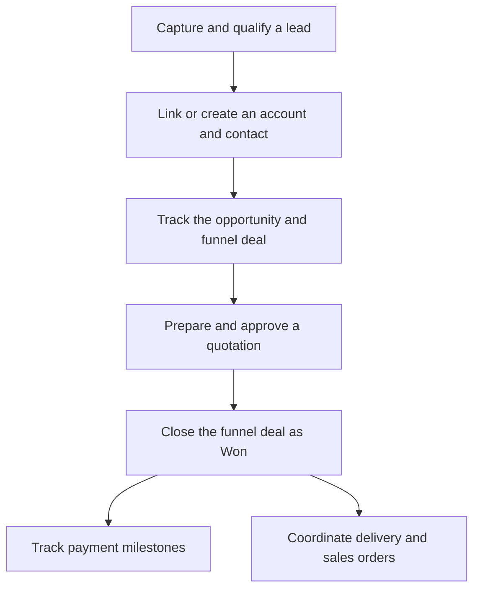
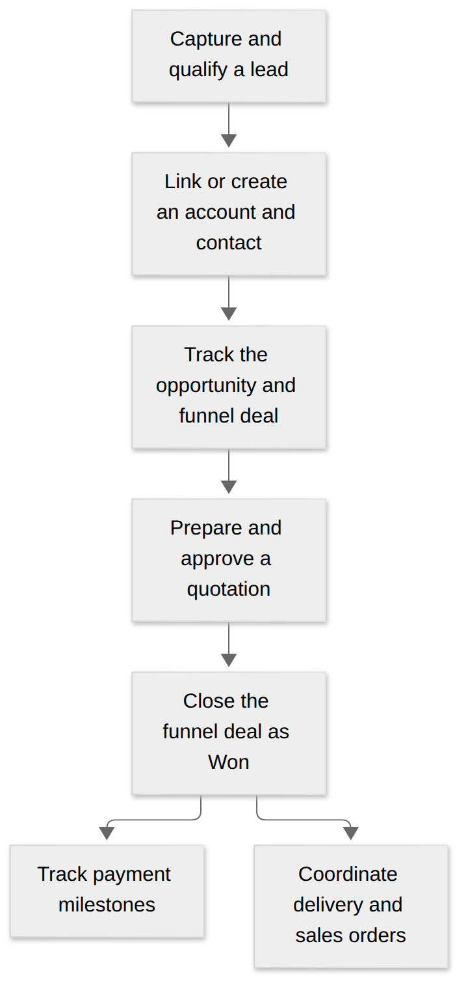

# Q-App User Guide

Use Q-App to manage customer relationships, prepare quotations, track sales, and hand work over to delivery. Start with the task you need today; you do not need to read every chapter first.

## Start here

| What do you want to do? | Open this guide |
| --- | --- |
| Learn where things are | [Workspace & personal views](01-workspace-and-views.md) |
| Follow your daily workflow | [Quick start by role](quick-start.md) |
| Add a prospect or convert a lead | [Leads & conversion](02-leads-management.md) |
| Update a company or contact | [Accounts & contacts](03-accounts-and-contacts.md) |
| Qualify a deal or change its stage | [Opportunities & sales funnel](04-opportunities-and-funnel.md) |
| Prepare, revise, or print a quote | [Quotations & revisions](05-quotations-and-revisions.md) |
| Track planned billing | [Payment milestones](06-payment-milestones.md) |
| Review a stage approval request | [Stage approvals](08-approvals-inbox.md) |
| Manage delivery or a customer order | [Projects & sales orders](07-projects-and-sales-orders.md) |
| Manage team access or settings | [Administration & settings](09-admin-and-settings.md) |


**Cannot find a button or module?** Your role permissions and the modules enabled for your organization determine what you can see. Check that you are in the correct organization, then ask your administrator to review your access.


## How the workflow fits together

This is an overview of the usual workflow. Approval requirements and available stages depend on your organization's configuration.

**In words:** qualify the prospect, confirm the customer records, work the deal, prepare an approved quote, and record the outcome. On Closed Won, live planned payment milestones become **Won**. Billing is recorded separately by updating eligible milestones to **Invoiced**.

View a static copy of the workflow

<figure><figcaption>
The same workflow as the diagram above, available as an image.
</figcaption></figure>

## Terms you will see

* **Account:** a company or organization you work with.
* **Contact:** a person associated with an account.
* **Opportunity:** the customer need and qualification context.
* **Funnel deal:** the sales pursuit with a stage, quotations, and expected close date.
* **Quotation:** the proposal you prepare for the customer.
* **Payment milestone:** a planned billing event; marking it Invoiced records billing status.

## Need help?

Use [Troubleshooting](help-center/troubleshooting.md) for a blocked action, or [Frequently asked questions](help-center/faqs.md) for a short explanation. [Guide updates](changelog.md) explains changes to this documentation.
