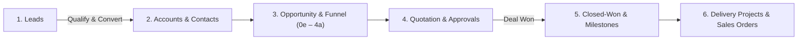

# Q-App User Guide

Welcome to the end-to-end user guide for **Q-App**. This guide provides a complete, step-by-step walkthrough of how to use each module directly within the user interface.

## The Lead-to-Cash Lifecycle

The system is organized around the business lifecycle—from capturing raw inbound interest to delivering projects and tracking commercial milestones.

### Module Flow Summary

| Stage | Module | Primary Objective |
| :--- | :--- | :--- |
| **Capture** | **Leads** (`/leads`) | Record inbound inquiries, qualify fit, and convert into durable records. |
| **Customer Core** | **Accounts & Contacts** (`/accounts`, `/persons`) | Maintain company profiles, required ISO currencies, and stakeholder contacts. |
| **Sales Pursuit** | **Opportunities & Funnel** (`/funnel`) | Track deal qualification using **PPVVC**, advance stages from `0e` to `4a`, and allocate project codes. |
| **Pricing & Terms** | **Quotations** (`/quotations`) | Generate itemized offers, apply tax settings, submit for approval, manage revisions, and download client PDFs. |
| **Deal Closure** | **Payment Milestones** (`/payment-milestones`) | Track revenue billing events; milestones automatically transition to `Won` upon deal closing, then to `Invoiced` upon billing. |
| **Delivery Handover** | **Projects & Sales Orders** (`/projects`, `/sales-orders`) | Connect sales commitments to operational delivery and track confirmed customer purchase orders. |
| **Governance** | **Approvals** (`/approvals`) | Review pending discount requests and stage advancement gates. |

---

## How to Use This Guide

* Follow the chapters in sequence from **Chapter 1** to **Chapter 9** for a complete walkthrough of the end-to-end workflow.
* Each chapter details:
  1. **What the module is** and why it exists.
  2. **Step-by-step UI actions** (where to click, what form fields to complete, and how to navigate).
  3. **Key business rules & automations** that run behind the scenes.
